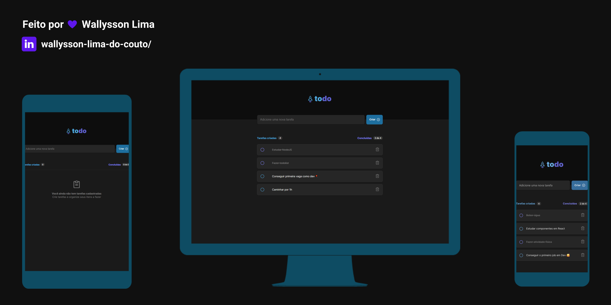

  

# 💻 ToDoList - Desafio 01 Ignite (@Rockeseat)

O desafio era reforçar conceitos importante do React JS. Funcionalidades como: 
- Estados
- Imutabilidade do estado
- Listas e chaves no ReactJS
- Propriedades
- Componentização
- <a href="https://to-do-list-ignite-mz6z3mtgg-wallysson.vercel.app/" target="_blank">Deploy (Vercel)</a>
- <a href="https://www.figma.com/file/X9wuZhd1Xlu1YJwSgvCXS9/ToDo-List-(Copy)?node-id=0%3A1" target="_blank">Layout Figma</a>

# 🚀 Tecnologias

- [ReactJS](https://reactjs.org/)
- [uuidv4](https://www.npmjs.com/package/uuidv4)
- [phosphor-react](https://phosphoricons.com/)

# 📑 Desafios

- Replicar o front end do figma ✔️
- Adicionar uma nova tarefa ✔️
- Marcar e desmarcar uma tarefa como concluída ✔️
- Remover uma tarefa da listagem ✔️
- Mostrar o progresso de conclusão das tarefas ✔️

# Previews

  

    <figure>
      
    </figure>
  

